听b站大神左程云算法课做的笔记

https://www.bilibili.com/video/BV13g41157hK/?p=7&spm_id_from=333.1007.top_right_bar_window_history.content.click
老师讲过的题目，如果在力扣上有，我也会带上链接，方便大家练习
## 入门
### 位运算
#### 异或
> 异或运算的性质
> 1. 相同的数异或为0，一个数和0异或为它本身
> 2. 异或运算满足交换率和结合率

**注意：go中没有按位与的符号，可以通过^n来实现**
**取某个数n的最右边的1**`rightone := n&(^n+1)`
###### 拓展
```
1. 一个数组，只有一个数为奇数个，其他均为偶数个，求这个数
```
leetcode:https://leetcode.cn/problems/single-number/
[异或](bitwise/01_异或.go)
```
1. 一个数组中，有两个数位奇数个，求这两个数
```


### 排序
#### 1.选择排序
> 从0开始进行n次循环，每次循环从当前值到数组末位，选择出一个最大或最小的值与当前位置进行交换
> 时间复杂度O(n^2)，空间复杂度o(1)

[选择排序](basic_sort/1.选择排序.go)
#### 2.冒泡排序
> 与选择排序相似，每次循环找出最小或最大的值，将其移动到数组末位，不过选择排序会记录最小或最大的值
> 一次循环只进行一次交换，而冒泡排序则对相邻元素比较，交换
> 时间复杂度o(n^2),空间复杂度o(1)

[冒泡排序](basic_sort/2.冒泡排序.go)
#### 3.插入排序
> 将要排序的值插入到已排序的值中，从第二值个开始遍历数组，将当前值前面的数作为已排序的序列，将当前值插入其中，
> 从而让有序序列的长度再次加1，然后再继续向下遍历,相比较于前面两个排序，插入排序的性能因为数据而有所不同，
> 当数据较为有序时，它的遍历次数会小很多，而选择与冒泡不会发生变化
> 时间复杂度o(n^2),空间复杂度o(1)

[插入排序](basic_sort/3.插入排序.go)
#### 4.归并排序
> 通过递归的方式，将给定的数据分为左右两个序列，分别让它们有序，然后将其合并，形成一个新的有序序列
> 时间复杂度,根据master公式为O(N*logN)，空间复杂度为O(N)

[归并排序](basic_sort/4.归并排序.go)
###### 拓展
```
1.求一个数组的小和 数组小和的定义如下：
例如，数组s = [1, 3, 5, 2, 4, 6]，在s[0]的左边小于或等于s[0]的数的和为0；在s[1]的左边小于或等于s[1]的数的和为1；在s[2]的左边小于或等于s[2]的数的和为1+3=4；在s[3]的左边小于或等于s[3]的数的和为1；
在s[4]的左边小于或等于s[4]的数的和为1+3+2=6；在s[5]的左边小于或等于s[5]的数的和为1+3+5+2+4=15。所以s的小和为0+1+4+1+6+15=27
给定一个数组s，实现函数返回s的小和
2.求数组逆序对
在数组中的两个数字，如果前面一个数字大于后面的数字，则这两个数字组成一个逆序对
```
#### 5.快速排序
> 1.荷兰国旗问题：给定一个数组，并给定一个值num，将比num大的数放到数组前段，将=num的数放到数组中段，大于
> num的数放到数组后段
> 解法：
> 1. 给定两个指针l,r,用来指定<区的后一位和>区的前一位
> 2. 通过索引i遍历数组,如果小于num,将当前位置与l位置交换，扩充<区，l++
> 3. 如果小于num,将当前位置与l位置交换，扩充>区，r--,不知道交换回值的大小，所以i应保持不变
> 4. 当i=r时，所有的数已经排列完毕
###### 快速排序2.0：
>1. 将数组的最后一位作为指定数，然后通过递归将数组转化为三块，再将指定数放到等于区
>2. 通过递归将数组各个部分都执行上述操作，最后得到有序的数组
###### 快速排序3.0：
>因为2.0版本的快排很受数据的影响，时间复杂度为O(n^2),3.0基于2.0将指定数num从最后一位，换成随机取，然后再与最后
>一位进行交换，因为随机，所以不会受数据状况影响，时间复杂度为O(n * logN),空间复杂度为O(logN)

[快速排序](basic_sort/5.快速排序.go)
#### 6.堆排序
##### 堆（heap）
> 一个存储了一棵完全二叉树的数组
> 如果每个子树的根节点都比其子节点大，则称为大根堆，根节点是整个树中的最大值，反之则为小根堆
##### 性质
> 1. 当前值在数组中的索引为i，则其左子节点的索引为（i*2)+1,右子节点为（i*2)+2
> 2. 当前值在数组中的索引为i,其父节点的索引为（i-1)/2
##### 操作（以大根堆为例）
> 1. 将数据入堆，heapsize +1 ,数据加入到二叉数的最后一个节点，然后判断其与父节点的大小，若大，则交换位置，
> 重复这个过程，直到没有父节点或父节点比它大，
> 2. 将数据出堆，弹出数组首位最大值，二叉树的最后一个节点提到头节点的位置，然后将heapsize - 1,
> 头节点判断其左右子树中最大的一个是否比自己大，若是，则交换位置，然后重复此操作，直到没有子节点或字节点都比小
##### 堆排序
> 1. 将指定数组遍历，让每个值都经历一次入堆操作，得到一个大根堆
> 2. 再次遍历大根堆，每次将头节点交换到堆的最后，然后再通过出堆的操作让剩余的数据依然形成大根堆，头节点为最大值
> 3. 重复二操作，直至堆中没有数据，此时数组成为升序序列
> 时间复杂度O(N*logN),空间复杂度O(1)

[堆排序](basic_sort/6.堆排序.go)
##### 堆的运用
> 一个数据流，每次从数据流中接收一个数字，保证每次都可以找出已经返回值中的中位数
> 1. 准备一个大根堆，一个小根堆
> 2. 将第一个数加入大根堆，如果下一个数字比大根堆堆顶小，则加入大根堆，否则加入小根堆
> 3. 如果大根堆或小根堆的个数差距达到二，则将数字较多的那个堆顶加入另一堆
> 4. 这样，每次的中位数不是两个堆顶相加/2,就是数字较多那个堆中的堆顶
###### 拓展
```
已知一个几乎有序的数组，几乎有序是指一个数距离它排好序的距离不超过k,并且k相对数组长度较小，请选择合适的排序算法
进行排序
```
#### 7. 桶排序
> 前面的排序方式都是通过比较来进行排序的，我们也可以不进行比较来排序
##### 1.计数排序
> 首先，知道数组值的范围，定义出一个此范围的辅助数组，遍历原数组，原数组中的每个数都对应辅助数组上的一位
> 所以，可以统计出每个数出现的次数，然后根据辅助数组记录的计录的次数将数据填入源数组接口完成排序
> 时间复杂度O(N)，空间复杂度O(N)
##### 2.基数排序（桶排序）
> 根据数据的位数来进行排序，
> 1. 判断数据位数（十百千这种），根据数据的进制准备一个长度等于进制数的数组
> 2. 从最低位开始,将它们从小到大装到准备好的数组中，得到一个最低位升序的序列，将其放回原数组
> 3. 然后上升一位，再对原数组重复2操作，得到当前位得有序序列，将其放回原数组，一直重复上述操作，直到最高位也有序

[基数排序](basic_sort/7.基数排序.go)
**注意：不通过比较的排序对数据的要求很高，如果数组中数的范围很大，就不适用，而比较排序可以适用于任何数组**
```
marst公式
在计算涉及递归的算法的时候，计算复杂度就会变得有些麻烦。Master公式就是用来进行剖析递归行为和递归行为时间复杂度的估算的

Master公式：T(N) = a*T(N/b) + O(N^d)

公式解释：n表示问题的规模，a表示递归的次数也就是生成的子问题数，N/b表示子问题的规模。O(N^d)表示除了递归操作以外其余操作的复杂度

结论（证明省略）：
①当d<logb a时，时间复杂度为O(N^(logb a))
②当d=logb a时，时间复杂度为O((N^d)*logN)
③当d>logb a时，时间复杂度为O(N^d)

注意：子问题规模必须等分，不管你是分成几部分
```
#### 排序算法稳定性
> 排序之后相等的值与排序下之前相对位置保持不变

|排序|时间复杂度|空间复杂度|稳定性|
|---|---|---|---|
|选择排序|O(N^2)|O(1)|不稳定|
|冒泡排序|O(N^2)|O(1)|相等值不换位置可以稳定|
|插入排序|O(N^2)|O(1)|相等值不换位置可以稳定|
|归并排序|O(NlogN)|O(N)|合并数组时相等时，先将左边的加入数组，稳定|
|快速排序|O(NlogN)|O(logN)|不稳定|
|堆排序|O(NlogN)|O(1)|不稳定|

#### 排序总结
> 1. 不基于比较的排序，对样本数据的要求高，不易改写
> 2. 基于比较的排序，只要规定好如何比较就可以直接复用
> 3. 基于比较的排序，时间复杂度最小为O(N*logN)
> 4. 绝对速度选快排，节省空间用堆排，稳定选归并


### .查找
#### 1.二分法
> 通常用来在有序集合中查找某个值，将数组为三，当前值，左边的，右边的
> 如果当前值是要找的值，则直接返回，否则判断左右哪个符合条件，再将其一分为3继续重复上述过程
> 最后总能找到要查找的值，时间复杂度O(logN)
> 其实只要能确定要查找的值必然在数组分隔的两端
> 就可以用二分法

[二分法](search/01_二分法.go)
###### 拓展
```
一个数组，求局部最小值(左右都比当前值大)
```

###  表
##### 有序表
> 其中所有元素以递增或递减方式有序排列
##### 哈希表
> 顺序存储的结构类型需要一个一个地按顺序访问元素，当这个总量很大且我们所要访问的元素比较靠后时，性能就会很低
> hash通过键值对映射的方式来加快访问记录，它是无序的
#### 链表
> 链表有一系列节点组成，节点主要包括当前节点值和它下一个节点的位置，由此链接成的链式结构
> 相比于数组，它的插入操作更快，但获取操作较慢
##### 重要技巧
> 笔试，以时间复杂度为要求
> 面试， 需要考虑时间复杂度
###### 常用方法
>1. 通过额外空间记录
>2. 快慢指针
###### 题目
```
1. 判断一个链表是否为回文链表
```
leetcode:https://leetcode.cn/problems/palindrome-linked-list/
[回文链表](link_list/1.回文链表.go)
```
1. 给定一个值，将链表分为小于给定值，等于给定值，大于给定值的三部分
```
leetcode:https://leetcode.cn/problems/partition-list-lcci/
[链表分区](link_list/2.链表分区.go)
```

1. 定义一种特殊的链表节点
{
    value,
    rand,
    next
}
rand是一个指针，可能指向某个节点或为空，给定一个由此节点构成的无环单链表，请将其复制，并返回头节点
```
leetcode:https://leetcode.cn/problems/copy-list-with-random-pointer/comments/
[复制链表](link_list/3.复制链表.go)
```
4.相交链表，给定两个链表，它们可能有环也可能没环，如果它们相交，返回它们相交的第一个节点，如果不相交，返回null
```
###### 题解
**切记千万不要脑部链表结构，最好画一下，看它们能不能用单链表实现**

**前置知识**
> 1. 求链表是否有环？
> 单链表有环只能有一种类似6的结构，环永远在最后
> 解法：
> 1. 通过hash表记录每个节点，在遍历的时候查看hash表中是否有此值，若有，则有环，并且第一个重复的值为环的起点
> 2. **快慢指针，如果有环，快慢指针总会相遇，如果相遇则有环，这时让慢指针停留到原地，快指针从头结点再开始跑，它们再次
> 相遇的地方就是入环的节点** （记住这个结论）

leetcode:https://leetcode.cn/problems/c32eOV/
[有环链表](link_list/4.有环链表.go)


**链表相交**
> 1. 判断两个链表是否有环
> 2. 如果都没有环，则两个都遍历到末位，判断是否相等，若不相等，则不相交，若相等，记录它们的长度，让较长的先走它们的长度差距步，然后两个同时开始走，相遇的地方即为相交的地方
> 因为如果相交，它们的尾节点一定是同一个
> 3. 如果一个有环，一个没有环，则它们必不可能相交
> 若它们都有环，则先记录两个链表的入环节点，若它们相同，则可以将其看作都没有环，将入环节点看作尾节点，用2即可解决
> 如不相同，则可以让一个入环节点在环上转一圈，如果碰到另一个则说明两个链表相交，并且他们俩两个的入环节点都可以看作第一个相交的节点
> 如果没碰到，则二者没有相交

[相交链表](link_list/5.相交链表.go)
### 二叉树 
#### 遍历
##### 递归 
###### 1.理解递归序
```
    func Traversal(root *ListNode){
        if (root == nil){
            return
        }
        // 1
        Traversal(root.Left)
        // 2
        Traversal(root.Right)
        // 3
    }
```
> 如上代码可以看到三个位置，函数在执行时会来到一个节点三次，在1，2，3的位置对当前的节点进行操作就是三种递归操作
> 1. 先序 根-左-右
> 2. 中序 左-根-右
> 3. 后序 左-右-根

leetcode:
先序：https://leetcode.cn/problems/binary-tree-preorder-traversal/
中序：https://leetcode.cn/problems/binary-tree-inorder-traversal/
后序：https://leetcode.cn/problems/binary-tree-postorder-traversal/

[递归遍历](binary_tree/1.递归遍历.go)
##### 非递归
######  1.先序遍历
> 准备一个栈，将头节点入栈，然后出栈时将它的子节点入栈，入栈时先入右子节点，然后继续重复上述出栈与入栈的操作，直到栈为空，弹出值的顺序为先序
###### 2. 后序遍历
> 准备两个栈，第一个栈操作与先序遍历一致，不过先入左节点，然后弹出的值压入另一个栈中，等第一个栈空了后开始将第二个栈的值依次弹出，直到栈为空，弹出值的顺序为后序
###### 3. 中序遍历
> 1. 准备一个栈，顺着左子节点直到将每个左节点入栈,直到整棵树的最左边节点也入栈
> 2. 从栈中弹出一个值，判断其是否有右节点，若有则进入右节点，重复1操作
> 3. 若没有右节点，重复1，2操作
> 弹出值的顺序为中序

[非递归](binary_tree/2.非递归.go)

##### 层序遍历
> 借助一个队列，将节点入队，出队时它的左右子节点入队，重复此过程，直到队列为空，返回的值即为层序

leetcode:https://leetcode.cn/problems/binary-tree-level-order-traversal/

[层序遍历](binary_tree/3.层序遍历.go)

###### 拓展
```
求二叉树最大宽度
```
leetcode:https://leetcode.cn/problems/maximum-width-of-binary-tree/

##### 常见的几种二叉树
###### 1.搜索二叉树
> 左子树的值必须小于当前值，右子树的值必须大于当前值
###### 解法：
> 中序遍历二叉搜索树，可以得到一个递增的序列
> 1. 用一个全局变量存储每一个节点的值，通过中序遍历来获取每个值，判断其是否大于上一个值
> 2. 如果它大于则继续判断下一个节点，并将值存到全局变量中
> 3. 如果它小于等于，它就不是搜索二叉树

leetcode:https://leetcode.cn/problems/validate-binary-search-tree/submissions/

[二叉搜索树](binary_tree/4.二叉搜索树.go)

###### 2.完全二叉树
> 按照顺序由左到右依次变满的树

###### 解法：
> 1. 通过层序遍历每个节点
> 2. 判断这个节点是否存在右节点而不存在左节点，若是，则不是完全二叉树
> 3. 如果一个节点只有左孩子而没有右孩子，或者它为叶子节点，则它后面的所有的节点都必须为叶子节点

[完全二叉树](binary_tree/5.完全二叉树.go)

###### 3.满二叉树
> 一个二叉树，如果每一个层的结点数都达到最大值，则这个二叉树就是满二叉树。也就是说，如果一个二叉树的深度为K，且结点总数是(2^k) -1 ，则它就是满二叉树。

###### 解法：
> 1. 通过层序遍历得到最大深度与总节点个数，直接判断
> 2. 通过递归判断左右节点是否都为完全二叉树，如果是，则返回true

[满二叉树](binary_tree/6.满二叉树.go)

###### 4.平衡二叉树
> 某二叉树中任意节点的左右子树的深度相差不超过1则为平衡二叉树

###### 解法：
> 当前值通过递归拿到左右子树的深度进行判断

leetcode:https://leetcode.cn/problems/ping-heng-er-cha-shu-lcof/submissions/

[平衡二叉树](binary_tree/7.平衡二叉树.go)

###### 二叉树递归套路
> 判断当前值是否需要从左右子树获得数据，另左右子树返回的数据类型一致，再通过当前值判断或汇总
> 1. 搜索二叉树
> 从左子树获得其最小值并获得左子树是否为搜索二叉树，从右子树或的其最大值并获得左子树是否为搜索二叉树,两边的数据不一致，
> 如果要用套路递归，则可以让每个子树返回三个值，（最大值，最小值，是否是搜索二叉树）,统一数据后即可递归
> 满二叉树（返回子树是否为满的）以及平衡二叉树（返回子树的深度，子树是否为平衡二叉树）的判断用了这个套路
> **这个套路虽然不是适用于任何情况，但适用性很广，很多和树有关的问题都可以试试这钟做法**

###### 题目
```
1. 求两个节点的最近公共祖先节点
```
###### 解法：
**1.hash表**
>1. 通过hash表记录每个节点得父节点，通过父节点再找父节点，就可以形成一个祖先节点链
>2. 将一个节点得祖先节点链抽离出来放到另一个hash表中，
>3. 另一个节点通过hash表在祖先链上回溯，判断祖先节点是否在新抽离出的hash表中，若有，则直接返回
**2.递归**
> 两个节点在一棵树中，只有三种情况，要么在某棵子树的两侧，要么一个为另一个的父节点
> 递归时，碰到这两个值直接返回，（若它是另一个值的祖先节点，则返回的就是它，若它不是另一个值祖先节点，则说明它们必然
> 存在于某棵子树的两侧，它们得公共祖先节点在上面，直接返回让上面判断）
> 然后通过父节点判断其所对应的另一侧子树有无另一个值，若没有
> 则继续往上返回，若有，则说明它们就在这棵子树的两侧，直接返回当前子树的根节点即可

leetcode:https://leetcode.cn/problems/lowest-common-ancestor-of-a-binary-tree/

[最近祖先](binary_tree/8.最近祖先.go)

###### 拓展
```
有一个如下节点组成的二叉树
type TreeNode struct {
    Val int  
    Left *TreeNode
    Right *TreeNode
    Parent *TreeNode
}
parent指向节点的父节点，根节点的parent为null,给定一个二叉树中的值，求它的后继节点
后继节点：中序遍历当前节点后面的节点为后继节点
```

```
将一纸条对折一次，会出现一个凹下去的折痕，对折两次纸条上的折痕为凹凹凸，三次为凹凹凸凹凹凸凸
给定一个值k，求其折痕分布
```

```
二叉树序列化与反序列化
以_作为一个值的结束，以#作为空值，然后将其链接成一个字符串即可
反序列化，直接根据_将其分隔成数组
```

### 图
> 图是由顶点集合以及顶点间的关系集合组成的一种数据结构。
> 即节点以及节点间线段连接成的数据结构
> 通常分为有向图（节点与节点之间的线段是有向的）
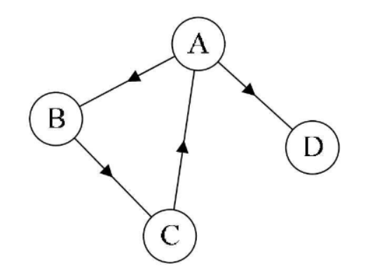
> 以及无向图
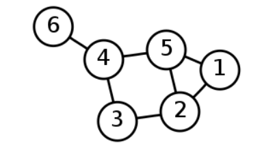
**出度与入度**
> 从某个节点出去的线的总数称为节点的出度,如上方有向图
> A的出度为2，进入某个节点的线的总数称为入度，A的入度为1
> 无向图的线可以看作是一条入的线和一条出的线组成的，所以它的出度和入度总是相等的
**邻接**
>可以从当前节点通过线走到的节点，即为当前节点的邻接节点，如上面有向图中A的邻接节点为B和D，因为是有向图，它无法到C
**权重**
> 两个节点之间的边的长度即为权重，没有权重的图称为无权图，上方的两个图都为无权图


#### 图的存储方式

> 1. 邻接表法
> 将每个节点存到容器中，每个节点又包含其邻接的所有节点，若有权重，则可以把每条边的权重也加上
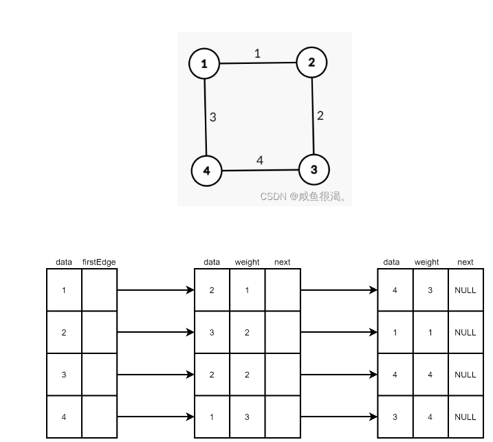
> data为相邻的节点，weight为它们之间边的权重
> 2. 邻接矩阵
> 用所有节点组成一个矩阵，它们交叉的点的值即为它们之间的距离
> 没有边可以直接到达，距离即为无穷大
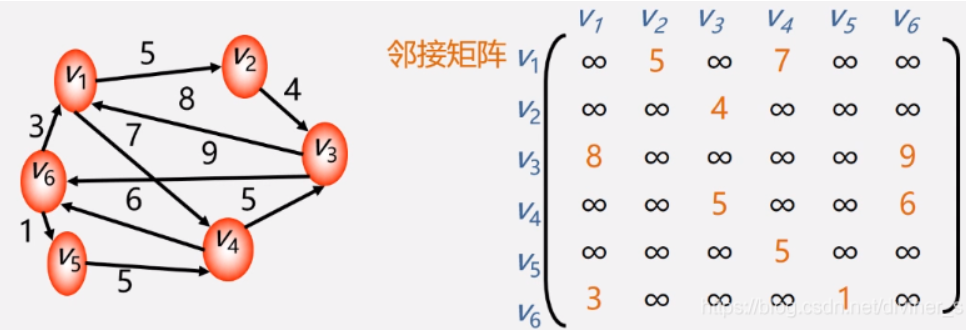

#### 图的模板
> 图的方式可能千奇百怪，要解决它们的问题就得研究这每一种结构
> 非常的麻烦，我们可以定义一种存储图的模板，碰到图有关的问题
> 直接将它转化为我们熟悉的模板来解决它

[图模板](utils/mapTemplate.go)

```
一个n*3的矩阵，
[[0,1,2][2，4，5][3，4，6]]
每一层代表一个边，
第一位代表来的节点，第二位代表去的节点，第三位代表权重
将其转化为我们的模板
```
[转化矩阵](map_test/1.转化矩阵.go)
> 我封装了一个输出模板的方法，输入`{{1, 4, 5}, {2, 3, 6}, {7, 5, 3}}`，这样一个矩阵
> 组成的模板输出为
```
{值：3,入度：1,出度:0,邻接节点:
{值：7,入度：0,出度:1,邻接节点:（节点值：5,权重：3)}
{值：5,入度：1,出度:0,邻接节点:
{值：1,入度：0,出度:1,邻接节点:（节点值：4,权重：5)}
{值：4,入度：1,出度:0,邻接节点:
{值：2,入度：0,出度:1,邻接节点:（节点值：3,权重：6)}
```
> 有了图的模板，我们直接在模板上练习各种操作，如果碰到其他类型的图，将其转化为模板类型，即可继续操作
#### 图的遍历
##### 1.广度优先
> 1. 准备一个队列
> 2. 将源节点入队
> 3. 出队一个节点，将其所有还未进过队列的邻接节点入队（可以通过另一个hash表来判断邻接节点是否入过队）
> 4. 重复3，直到队列为空

[广度优先](map_test/2.广度优先.go)
##### 2.深度优先
> 1. 准备一个栈
> 2. 将源节点入栈
> 3. 弹出一个节点，并将其未进过栈的节点压入栈
> 4. 重复3,直到栈为空

[深度优先](map_test/3.深度优先.go)

##### 拓扑排序
> 一个有向无环图，从一个节点开始将所有顶点组成一个线性的序列
> 序列中每个顶点只能出现一次
> 任何一对由边连起来的顶点，线段出发的顶点总在前面
###### 应用
> 很多打包工具在打包依赖时就是拓扑排序，从一个入口文件开始，根据文件相互依赖的关系来将它们打包在一起
###### 写法
> 1. 准备一个队列存储入度为0的节点
> 2. 找到入度为0的节点，它就是入口
> 3. 将入度为0的节点的邻接节点的入度-1(注意：不要在图结构上直接改，可以用一个（节点->剩余入度）组成的hash表记录下来，然后在这个表中改)，然后将里面入度为0的节点加入入度为0的队列
> 4. 弹出一个入度为0的节点，重复上述过程，直到队列为空 
> 这个过程有点类似于宽度优先，但它们并不相同，这里的值只有入度为0才能加入队列
##### 生成树
>一个连通图（如果图中任意两点都是连通的，那么图被称作连通图。如果此图是有向图，则称为强连通图（注意：需要双向都有路径））的生成树是该连通图的一个极小连同子图,它含有图中全部顶点,和构成一棵树的(n-1)条边.如果在一棵生成树上添加任何一条边,必定构成一个环,因为这条边使得它依附的那两个顶点之间有了第二条路径.一棵有n个顶点的生成树(连通无回路图)有且仅有(n-1)条边,但是,有(n-1)条边的图不一定都是生成树.如果一个图有n个顶点和小于(n-1)条边,则是非连通图;如果它有多于(n-1)条边,则一定有回路.
###### 最小生成树
**适用于无向图**
>  对于一个带权(假定每条边上的权值均为大于零的实数)连通无向图G中的不同生成树,各树的边上的权值之和可能不同；图中所有生成树中具有边上的权值之和最小的树称为该图的最小生成树.
>按照生成树的定义,n个顶点的连通图的生成树有n个顶点和(n-1)条边.因此构造最小生成树的准则有三条:
> 1. 必须只使用该图中的边来构造最小生成树;
> 2. 必须使用且仅使用(n-1)条边来连接图中的n个顶点;
> 3. 不能使用产生回路的边.
###### 1.Kruskal
>   克鲁斯卡尔算法的基本思想是以边为主导地位，始终选择当前可用（所选的边不能构成回路）的最小权植边。所以Kruskal算法的第一步是给所有的边按照从小到大的顺序排序。这一步可以直接使用库函数qsort或者sort。接下来从小到大依次考察每一条边（u，v）
> 1. 获取到所有边中最小的边，判断边的两边是否是同一个集合，若是则重新挑选边
> 2. 若不是，则将边两边的集合合并，再继续找下一个最小边
> 3. 重复上述过程，直到没有边
> 因为要用到并查集，所以我没写全，等学到并查集再补全
###### 2.prime 
> 1. 准备一个小根堆
> 2. 从一个顶点出发，将它的所有出去的边加入到堆中，然后从堆中取出一个最小的边，将边的另一头加入到生成树中
> 3. 边另一头的节点也有许多边出去，将它们都加入到堆中，然后再从中取出最小的边，重复上面过程
> 4. 直到最小生成树的节点与原树的一样（遍历n-1次，每次拿到一个边，n为节点个数）

参考：https://blog.csdn.net/qq_41181772/article/details/89357461?ops_request_misc=&request_id=&biz_id=102&utm_term=%E6%9C%80%E5%B0%8F%E7%94%9F%E6%88%90%E6%A0%91&utm_medium=distribute.pc_search_result.none-task-blog-2~all~sobaiduweb~default-0-89357461.142^v73^insert_down3,201^v4^add_ask,239^v2^insert_chatgpt&spm=1018.2226.3001.4187

[最小生成树](/map_test/5.最小生成树.go)

##### Dijstra
**权重不能为负数**
> 求出一个有权图中一个顶点到其他所有顶点的最短路径
> 1. 拿到给定的节点，判断其到其他节点的距离，能够直达的则记作其权重，无法直达的记作正无穷
> 2. 从剩下的节点中挑选出一个距离最近的，将它的距离确定，然后再判断它和剩下节点的距离，如果让剩下节点距离头节点的距离变小了，则将其替换
> 3. 再从剩下所有的节点中取一个距离最小的，重复这个过程，直到所有节点的最小距离都确定

推荐 https://blog.csdn.net/qq_44431690/article/details/108175827

https://blog.csdn.net/lbperfect123/article/details/84281300?spm=1001.2101.3001.6661.1&utm_medium=distribute.pc_relevant_t0.none-task-blog-2%7Edefault%7ECTRLIST%7ERate-1-84281300-blog-108175827.pc_relevant_multi_platform_whitelistv4&depth_1-utm_source=distribute.pc_relevant_t0.none-task-blog-2%7Edefault%7ECTRLIST%7ERate-1-84281300-blog-108175827.pc_relevant_multi_platform_whitelistv4&utm_relevant_index=1
> 写起来好麻烦，写的头昏脑涨🤦‍♂️，要是有可以优化的地方记得提醒，因为图的题很少，所以验证起来比较麻烦
> 不过用矩阵转化的方式还是可以得到我们想要的图的

##### 前缀树
> 1. 定义节点结构，pass:代表经过这个字符的次数，end:代表以这个字符作为结束的次数，数组，用来存储可以由当前节点去的节点
> 2. 通常要做的题，字符串都是由全英文字母组成的，我们可以让每个节点都默认有26条路，刚开始都为null即可
> 3. 每加入一个字符串，将其拆分为字符数组，顺着当前已有的路径往下走，如果要去的节点已经有路，则对应节点pass+1,如果没有，则新建一个节点连到当前节点上
> 4. 直到字符数组的每一项到加入了前缀树中，它结尾的字符end+1

leetcode:https://leetcode.cn/problems/QC3q1f/

[前缀树实现](utils/Trie.go)

##### 贪心算法
> 贪心算法种类繁多，每种题都不一样，要练习可以先写出一个复杂度较高的简单方法，然后用对数器和自己想的各种
> 想法进行比较
> 这个暂时先放一放👻

### 暴力递归
> 很多问题通过划分成一个一个的局部，然后通过递归将所有可能都得到，这就是暴力递归
> 注意：在做递归时，只用关注局部的问题，如果想全局会乱掉
##### 汉诺塔
>  汉诺塔问题是一个经典的问题。汉诺塔（Hanoi Tower），又称河内塔，源于印度一个古老传说。大梵天创造世界的时候做了三根金刚石柱子，在一根柱子上从下往上按照大小顺序摞着64片黄金圆盘。大梵天命令婆罗门把圆盘从下面开始按大小顺序重新摆放在另一根柱子上。并且规定，任何时候，在小圆盘上都不能放大圆盘，且在三根柱子之间一次只能移动一个圆盘。问应该如何操作？（每次只能移动1个盘子，大盘子只能放在小盘子下面）
> 1. 将n个盘子分为两部分，n和n-1，先将n-1个盘子挪到中间的柱子上，再将第n个盘子挪到第三个柱子上，最后再将n-1个盘子挪到第三个柱子上

leetcode:https://leetcode.cn/problems/hanota-lcci/
[](violence/汉诺塔.go)
推荐：https://blog.csdn.net/m0_68989458/article/details/124087487

##### n皇后问题
> 八皇后问题是十九世纪著名的数学家高斯于1850年提出的。问题是:在8×8的棋盘上摆放八个皇后，使其不能互相攻击，即任意两个皇后都不能处于同一行、同一列或同一斜线上。可以把八皇后问题扩展到n皇后问题，即在n×n的棋盘上摆放n个皇后，使任意两个皇后都不能处于同一行、同一列或同一斜线上。 
> 找到每一行的满足条件的点，然后继续向下一行找，如果遇到不满足的情况，则退回到当前行，并在当前行上继续找下一个可能的点
> 如果走到了棋盘末位，则就是一种摆法，可以将它输出
> 类似于一个树结构

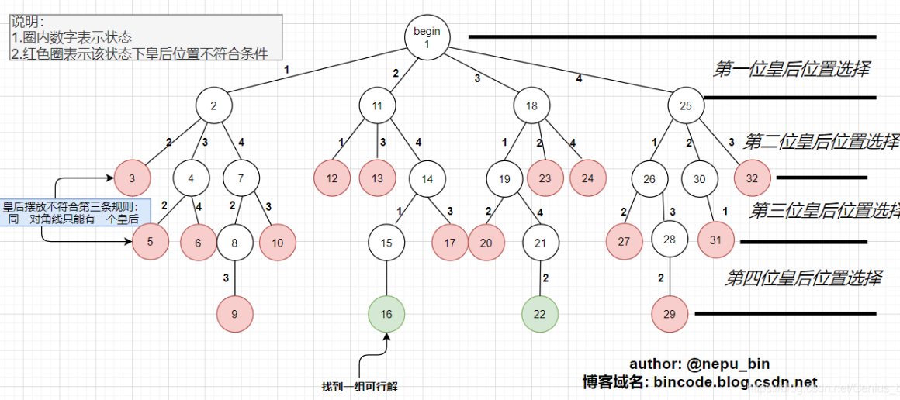
推荐：https://blog.csdn.net/HowToPause/article/details/127319625?utm_medium=distribute.pc_relevant.none-task-blog-2~default~baidujs_baidulandingword~default-0-127319625-blog-81279625.pc_relevant_landingrelevant&spm=1001.2101.3001.4242.1&utm_relevant_index=3
https://blog.csdn.net/qq_45914558/article/details/107294721?utm_medium=distribute.pc_relevant.none-task-blog-2~default~baidujs_baidulandingword~default-0-107294721-blog-127319625.pc_relevant_3mothn_strategy_recovery&spm=1001.2101.3001.4242.1&utm_relevant_index=3

leetcode:https://leetcode.cn/problems/n-queens/
[八皇后](violence/8皇后.go)

## 基础进阶
> 前面两天听的不是很认真，没什么状态🥱，今天继续好好听讲
### 1.hash函数及hash表
#### hash函数
> 输入某个任意长度的数，通过某种计算方式得到一个长度一定的返回值，常见的如MD5
> 1. 输入域可以看作是无穷的，输出域是有穷的，md5的返回值就在0到2^32
> 2. 相同的输入值得到的输出值一定是相同的（计算时不会带有随机因素），不同的输入值可能会得到相同的值（哈希碰撞），但概率极小
> 3. 如果数比较多，它输出的值一定近乎均匀的分布在输出域中
#### 哈希表
> 哈希表可以看作是一个一个的桶，hash表的存储过程即是使用hash函数将要输入的值转化为某个数
> 然后再%hash表的长度，例如hash表如果长度为n，则可以看作是有n个桶，
> 将值%n,则得到的值一定再0-n-1之间，将它放入相对应的桶即可，如果一个桶有多个数，则会将它们按照
> 链表的方式串联起来（不同的hash表在这里的实现不同）,链表不会太长，遍历是常数时间
> 在查值时会重复相同的操作，找到对应的桶，再遍历链表找到对应的值
> 链表的长度如果比较长了，则hash表会进行扩容，会将所有的数重新计算一遍，再放入对应的桶
> 较为高级的语言一般会自动进行扩容操作，不会影响执行时间
> 所以，hash表查值可以近似的看作O(1)
###### 题目
```
设计randomPool结构
1. insert(),它可以添加key,并保证不重复
2. delete(),它可以删除key
3. getRandom(), 可以随机获取结构中的任意一个key
要求
三种操作的时间复杂度都不能超过O(1)
```

###### 题解：
> 通过两个hash表来做，以用来记录输入的值和位置关系的映射h
> 一个用来记录位置关系和输入值的映射r
> 查找时直接通过h即可找到，随机返回时,通过随机函数0-size之间，通过r即可找到对应的值
> 删除的时候需要保证连贯性，我们可以找到要删除值的位置index，将h中最后一个key对应的value改成index
> 然后删除这个值在h表中
> 而在r中，我们要将对应位置的值，转化为最后一位的值，最后删除最后一位，size--
> 

[randomPool](basic_advance/1.RandomPool.go)

#### 布隆过滤器
##### 位图
> 位图就是位数组，可以找到每个位置上对应的0/1
> 语言中没有这种数组，我们可以通过基础类型数组拼出来

[位图](basic_advance/2.位图.go)
##### 应用
> 常用来判断一个元素是否在某个集合里
> 如，网页黑名单，访问一个网页，它会去集合中判断这个网页是否合法
##### 特点
> 1. 可以拦截任何非法的操作
> 2. 有可能拦截一些合法的操作（可以人为减少失误率）
##### 原理
> 布隆过滤器有几个特征
> 要拦截样本数量n,hash函数个数k,还有一个位数组arr，长度为m
> 将不合法的值通过k个hash函数得到k个不同的值
> 在将这k个值%m，得到一系列从0到m-1位的值，将它们放置到数组arr对应的位置中
> 在检测时，也是通过上述步骤，一个数据得到的位数据看它对应的位是否都已有值
> 如果都有，则它不合法
> 这样，不合法的值肯定能被拦截，但如果n很多/arr很小/k很多，几个不合法的值全占满了
> 那合法的值也会被拦截
> 所以arr的长度，hash函数的个数，与要拦截的样本数量n之间的关系决定着误差率的大小
> 公式如下
> 误差率:
> 由拦截样本数量n，hash函数个数k,位数组长度m来计算误差率
> 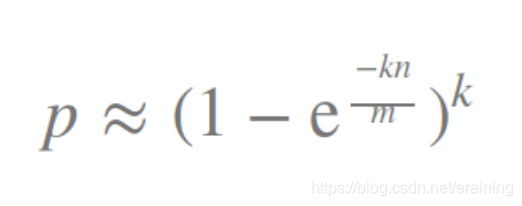
> 由误差率结合n或m计算另外的一个值，来决定合适的业务
> 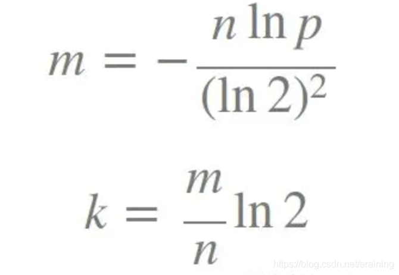

推荐：https://blog.csdn.net/qqq3117004957/article/details/104834702/

#### 一致性hash

> 推荐这个讲的很详细

https://blog.csdn.net/a745233700/article/details/120814088?ops_request_misc=%257B%2522request%255Fid%2522%253A%2522167765997616800186579811%2522%252C%2522scm%2522%253A%252220140713.130102334..%2522%257D&request_id=167765997616800186579811&biz_id=0&utm_medium=distribute.pc_search_result.none-task-blog-2~all~top_positive~default-1-120814088-null-null.142^v73^insert_down3,201^v4^add_ask,239^v2^insert_chatgpt&utm_term=%E4%B8%80%E8%87%B4%E6%80%A7%E5%93%88%E5%B8%8C&spm=1018.2226.3001.4187

### 2.并查集与kmp

#### 岛问题
> 一个由0和1组成的二维数组，连成一片的1代表一个岛，1可以和上下左右四个方向相连
> 给定这么一个数组，求岛的个数
> 做法是遍历每个点，如果它是1，则将其改成2,然后再判断它周围的节点是不是1，若是也改成2,直到与它相连的节点全变成2了
> 再继续遍历，因为改成2了，所以不会有重复的问题

leetcode:https://leetcode.cn/problems/ZL6zAn/submissions/
> 注意力扣是求最大面积

[岛问题](basic_advance/3.岛问题.go)

#### 并查集
> 如何判断两个数是否在同一个集合中，可以使用并查集
> 它可以看作一个类似链表的结构，最开始，每个值都指向自己/空。
> 1. 判断两个值是否在同一个集合中，则顺着链表一直往上走直到走到链表顶端，如果两个值往上走找到的值一致，则说明它们是在一个集合中
> 2. 并查集的合并，则是将较短的那个集合的顶点接到较长集合
> 3. 优化：这样连接并查集的链可能会很长，所以在判断两个值是否在同一个集合时有一个向上找顶端的过程
> 在这个过程中，将每个节点都直接指向顶端节点，需要查找的时候就可以直接找到，而不用遍历向上找的过程

[并查集](basic_advance/4.并查集.go)
> 我是用链表来串的，老师是用hash表来映射每个节点的父节点的，实现方式多种多样

#### Kmp
> 有两个字符串，str1,str2判断str2是否是str1的子串，如果是则返回匹配的第一个索引
> 如果不是则返回-1

###### 经典解法
> 遍历第一个字符串的每个节点来与str2对比，到匹配不上时继续下一个节点匹配
> 时间复杂度O(n*m),n为str1的长度，m为str2的长度

###### KMP算法
> kmp算法就是用来优化上面解法的，它可以分为几步
> 1. 将str2的每个位置前的子串的前后缀相等的最大长度存起来，例如aaabbcccaaad，则d位置存的就是3,因为它前后缀相等的最大长度就是3
> 2. 对比str1与str2,直到它们不相等的位置e,k，拿到k这个节点的最大前缀长度，让e与k最大前缀长度的下一个位置f比较
> 3. 如果还不相等，则f继续找它最大前缀的下一个位置与e相比，循环这个过程，直到e与str2的第一个节点也不相等，则从e开始继续往后比较，重复上述过程
>时间复杂度为O(n)

> 表达能力太差了，自己感觉说的很不清楚😵‍💫，强烈推荐看老师的视频

[Kmp](basic_advance/5.Kmp.go)

### 3.Manacher，滑动窗口，单调栈
#### Manacher
> 有一个字符串，求它最长的回文子串，时间复杂度在O(N)
##### 经典解法
> 遍历字符串每一位，将其当作中心向两边扩展，直到两边不相等，可以得到所有的回文子串以及它们的长度
> 但这样有一个问题，因为要从一个中心向两边扩，就会将偶数长度回文子串忽略
> 为了解决这个问题，会在字符串中加入特殊字符
> 例如: aaabbbbccc 变成 #a#a#a#b#b#b#b#a#a#a#
> 在整个字符串两边以及每个字符之间都加入了#,然后依然从每个位置向两边扩散，只要将最后得到的最大值除2即可
##### Manacher
> 经典解法的时间复杂度为O(N^2)级别，Manacher可以优化它
###### 步骤
> 1. 依然给字符串加特殊字符
> 2. 定义一个数组用来存储每个位置为中心的子串回文半径（回文串长度的一半）
> 3. 定义一个R,用来存储当前值前面值的回文半径的最大右边界，例如aaabbcccaaad，0位置的R为-1，1位置的R为0，2位置的R为2，因为aaa是一个回文，1位置将R拓展到了2
> 4. 定义一个C用来存储R对应的中心位置，例如aaabbcccaaad，R=2,则对应的c为1,因为它是整个子串的中心
> 4. 遍历字符串中每一位
>    1. 当前位i>R,则直接往两边扩展寻找对应的回文串
>    2. 当前位i<R,则找到R对应的C,根据C找到关于C对称的节点i'
>          1. 如果i'的回文半径在R的对称点L中，则i的回文串的长度==i'回文串的长度
>          2. 如果i'的回文半径超出了R的对称点L,则i的回文串的长度为i'到L的长度
>          3. 如果i'的回文半径恰好等于R的对称点L,则i的回文子串从R处继续开始向扩展

[Manacher](basic_advance/6.Manacher.go)

leetcode:https://leetcode.cn/problems/longest-palindromic-substring/

#### 滑动窗口
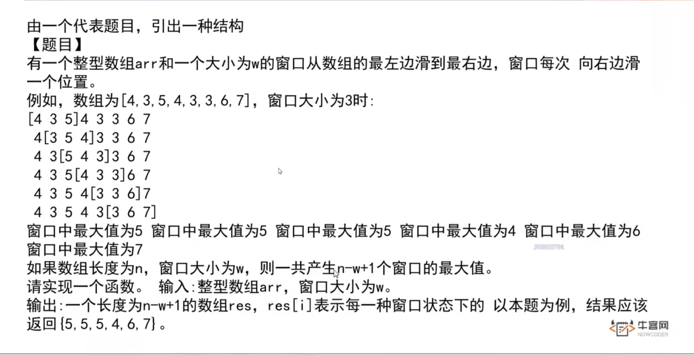
> 这种题目我们叫做滑动窗口
> 通常用双向队列(两边都可以添加和弹出值的队列)来解决
> 以求窗口中最大值为例
> 求最大值，双向队列的值应当是由大到小的
> 如果窗口右边前进一位，则判断新的值s是否可以从后面进入队列，如果队列中有比它小的值，则全部出队，最后队列头的那个值就是窗口的最大值
> 如果窗口左边前进，则判断从窗口中出来的值是否和队列头相等，如果是，则弹出队列的头，窗口中的最大值依然是队列的头

leetcode:https://leetcode.cn/problems/sliding-window-maximum/submissions/
[滑动窗口](basic_advance/7.滑动窗口.go)

>写这题的时候犯了一个简单的错误找了半天😕，一定要记得go语言中切片在扩容时会更改路径，所以就算传进去的是地址也没用
> 影响不到外面的值，需要有返回值

#### 单调栈
> 找到一个数组中每个值前面离自己最近的比自己大的值
> 以及它后面离自己最近比自己大的值
> 这样的问题可以通过单调栈来解决
> 1. 定义一个单调递增的栈，栈底到栈顶逐渐减小
> 2. 一个值入栈时，如果栈内有比他小的值，则直接弹出
> 3. 每个值在弹出时它要替换它的值即为后面大的，它底下的值则为前面大的
> 4. 最后遍历完整个数组，再将栈中剩余的值弹出，它们后面都没有比它们大的值

> 以上做法适用于数组没有重复值的，若是有重复值，则将相同两个数的索引
> 放在同一个格子中（链表或数组）

[单调栈](basic_advance/8.单调栈.go)
> 我是用数组来存储重复值的，链表也可以

###### 题目


### 4.树形Dp套路 Morris遍历
#### 树形Dp套路
> 以前做二叉树的时候也提到过，能从左右节点要到信息在根节点整合答案都可以用套路
> 将左右返回的值统一格式，然后再在根节点汇总即可
###### 题目
1. 二叉树节点间最大距离
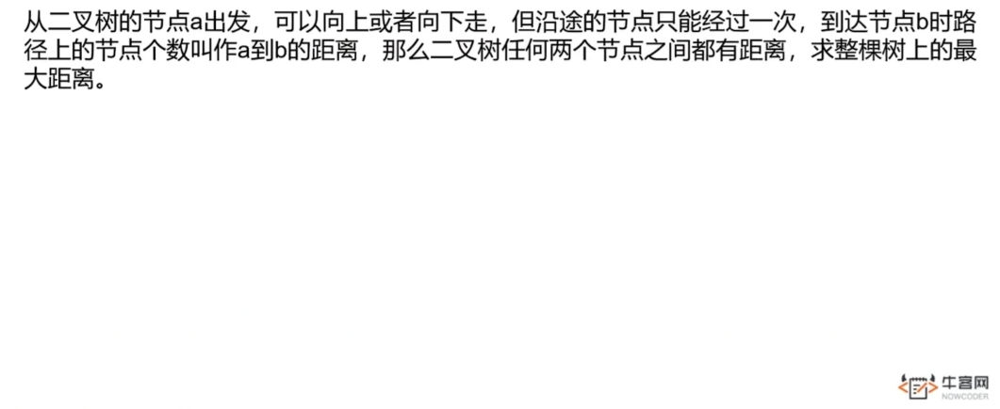

> 这个问题可以分为两种可能
> 1. 两个相距最远的点，经过头节点
>       如果它们经过头节点，那这两个点的距离一定是左右子树的高度相加再+1（头节点）
> 2. 如果不经过头节点，那它一定在子树的内部

>根据这两种可能，我们可以得到从左右子树返回的值应该为它内部两点的最大距离以及它的高度
> 那么整颗树的最远距离即为左右两边各自的最大距离与左右子树高度相加+1得到的值中最大的那个

[二叉树节点间最远距离](basic_advance/9.节点间最大距离.go)
> 做这种题检验可以去力扣二叉树的题里找一个输入和输出类型都一样的，测试用例那里生成咱们想要的树，直接执行判断，还是挺方便的

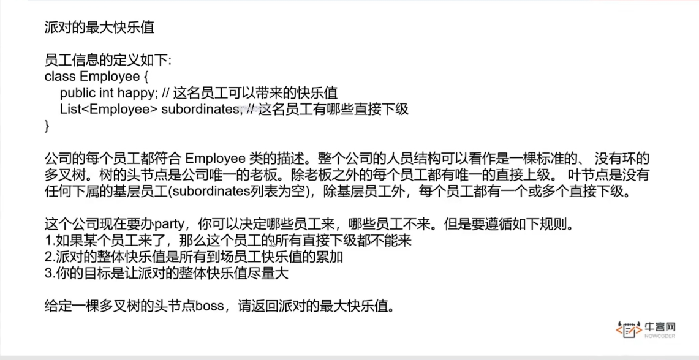
> 这道题虽然不是二叉树，但依然可以用树形DP套路来做
> 对于每一个节点，它有两种可能
> 1. 参加party
>    参加party后，它的直接下属无法来参加，所以它带来的快乐值就是
>    它本身的快乐值+所有下属节点不参加party的最大快乐值相加
> 2. 不参加party
>    不参加party，生成的最大快乐值就是它每个下属参加/不参加party中最大的快乐值相加

[最大快乐值](basic_advance/10.最大快乐值.go)

#### Morris遍历
> 二叉树的遍历咱们可以通过递归的方式和非递归的方式，但它们的空间复杂度都是O(N)
> 而Morris遍历二叉树，它的空间复杂度可以是O(1)


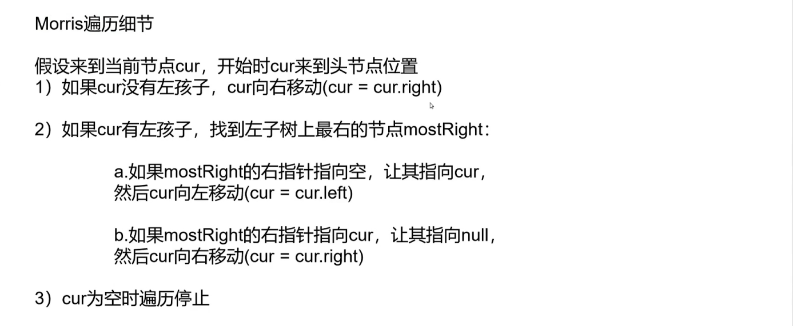
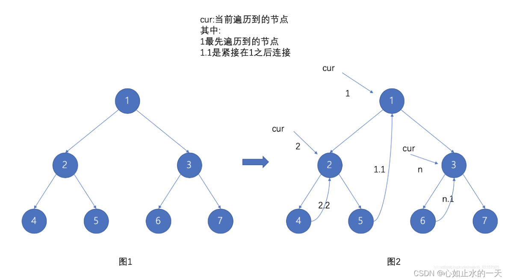
**注意：使用morris遍历的过程中会对节点的指针进行修改
如果题目严格不能更改的话就不能使用**

推荐：https://blog.csdn.net/m0_57802508/article/details/127193917?spm=1001.2101.3001.6650.6&utm_medium=distribute.pc_relevant.none-task-blog-2%7Edefault%7EBlogCommendFromBaidu%7ERate-6-127193917-blog-108863441.pc_relevant_recovery_v2&depth_1-utm_source=distribute.pc_relevant.none-task-blog-2%7Edefault%7EBlogCommendFromBaidu%7ERate-6-127193917-blog-108863441.pc_relevant_recovery_v2&utm_relevant_index=12
> morris遍历时，每个左子树不为空的节点都会来到它本身两次，在第一次的时候就操作当前节点即为先序遍历
> 在第二次的时候来到当前节点即为中序遍历
> 因为没有第三次到达，所以morris做后序遍历并不好做，老师讲的是将每个子树的右边界逆序
> 但如果要返回数组的话，感觉还是很难
> 我们可以这么做，先序遍历的顺序为中-左-右
> 如果我们在先序时中-右-左,然后将其反转即可得到后序遍历的值
> 将前序遍历改成中-右-左是比较简单的,也不会多占用空间的

[Morris遍历](basic_advance/11.Morris遍历.go)

### 5.大数据类题目 位运算
#### 大数据
> 这个没什么能写的题目，把老师说的技巧放在下面了

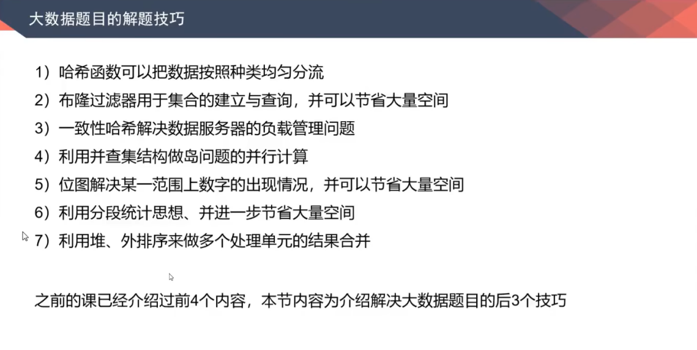
#### 位运算
###### 题目
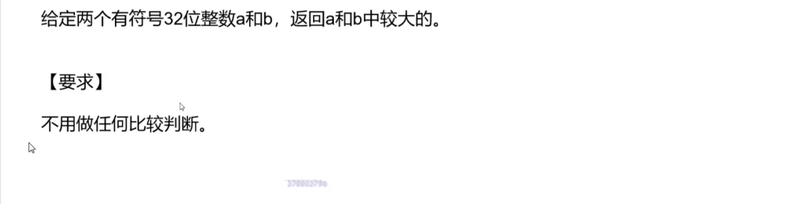

> 无法用比较，我们只能通过两个值相减结果的正负来判断

[比大小](/basic_advance/12.比大小.go)


[2的幂4的幂](basic_advance/13.2的幂4的幂.go)

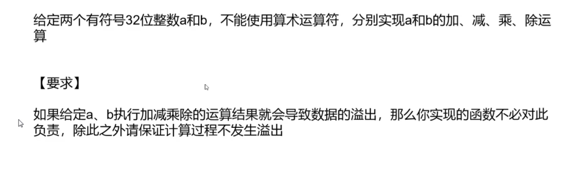

[](basic_advance/14.加减乘除.go)

### 6.动态规划
> 动态规划题目一般分为三步
> 1. 列出可能，通过递归求解
> 2. 通过记忆搜索优化递归
> 3. 通过严格表来判读依赖
###### 题目
```
1. 有一个长度为n的数组，有一个小机器人位于s,e为小机器人要到达的地方
k为小机器人必须要走的步数，小机器人每次只能走1步，或向前，或向后
判断小机器人到达e有几种走法
```
> 机器人每次都只能走一步，或向前或向后，所以机器人在每个位置
> 都有两种走法，将它们加起来就是每个位置的可能
> 但这样递归总会有重复值，我们可以用一个数组将已经出现的可能性存起来
> 数组的轴是可变的值，这里可变的值就是当前位置与剩余步数
> 只要碰到递归过的可能性就不用再向下递归了
> 知道递归怎么做后，我们就可以通过做严格表，确定依赖关系来优化递归算法了

[机器人](basic_advance/15.robot.go)

```
2. 给定一个正数数组，数组每一位代表一枚硬币，给定一个面值aim
求能达到这个面值的硬币的最小个数
```

[最小硬币](basic_advance/16.硬币.go)

```
3. 拿牌游戏
给定⼀个整型数组arr，代表数值不同的纸牌排成⼀条线。玩家A和玩家B依次拿⾛每张纸牌，规定玩家A先拿，玩家B后拿，但是每个玩家每次只能拿⾛最左或最右的纸牌，玩家A和玩家B都绝顶聪 明。
请返回最后获胜者的分数
```
[拿牌游戏](basic_advance/17.拿牌游戏.go)

```
4.题⽬：给定五个参数n,m,i,j,k。
表⽰在⼀个N*M的区域，Bob处在(i,j)点，每次Bob等概率的向上、下、左、右四个⽅向移动⼀步，Bob必须⾛K步。
如果⾛完之后，Bob还停留在这个区域上，并且期间没有出过格⼦，就算Bob存活，否则就算Bob死亡。
请求解Bob的⽣存概率，返回字符串表⽰分数的⽅式。
```
[鲍勃的生存概率](basic_advance/18.鲍勃的存活率.go)

```
5.题⽬：给定数组 arr，arr 中所有的值都为正数且不重复。
每个值代表⼀种⾯值的货币，每种⾯值的货币可以使⽤任意张
再给定⼀个整数 aim，代表要找的钱数，求组成 aim 的⽅法数。
```

[硬币2](basic_advance/19.硬币2.go)

推荐：https://blog.csdn.net/m0_50946672/article/details/128310440?ops_request_misc=&request_id=&biz_id=102&utm_term=%E5%B7%A6%E7%A5%9Eb%E7%AB%99%E7%AE%97%E6%B3%95%E7%AC%94%E8%AE%B0&utm_medium=distribute.pc_search_result.none-task-blog-2~all~sobaiduweb~default-0-128310440.142^v73^insert_down3,201^v4^add_ask,239^v2^insert_chatgpt&spm=1018.2226.3001.4187

> 基础班学暴力递归的时候很难理解递归，现在逐渐理解递归，但感觉严格表还是比较难，可能等中级班会逐渐理解🤣

### 7.有序表
> 只要了解原理即可，面试一般不会手写

推荐：https://www.cnblogs.com/yrxing/p/15770355.html

## 中级班
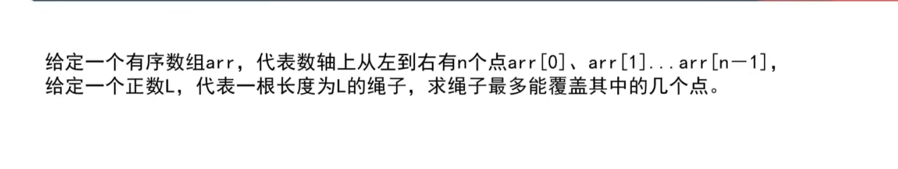
> 利用滑动窗口的思路解答

[绳子覆盖的最大节点个数](middle/1.绳子可以覆盖的节点数.go)


> 打表法，先用简单的方法做出来，然后打印结果查找规律

[买苹果](middle/2.小虎买苹果.go)

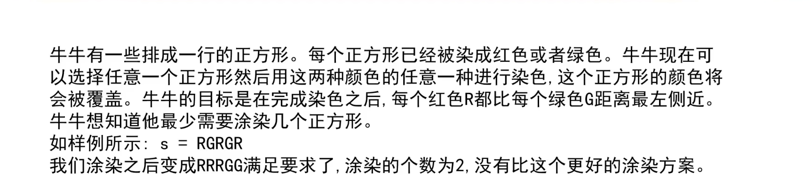

> 预处理法，空间换时间，用额外的空间来来替换遍历过程

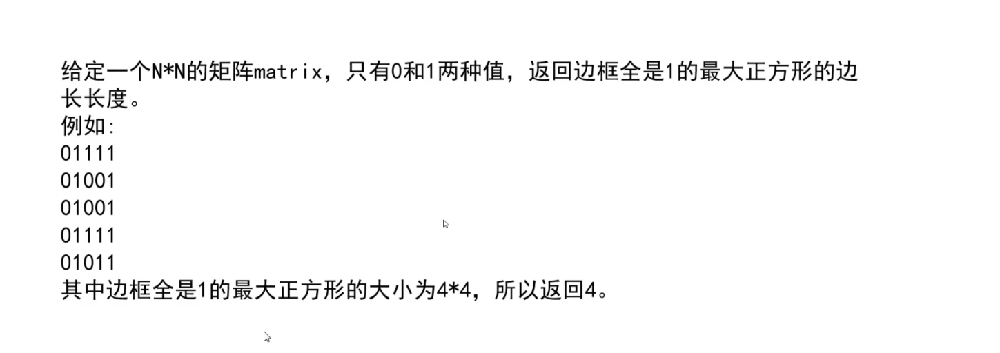


> 随机数是通过将给定的随机函数改造成返回二进制的数
> 然后通过二进制拼接起来

> go语言随机数需要随机数种子，一般用的是时间，所以遍历速度太快它得到的值是一样的

[随机数](img/中级/随机数.png)


> 遍历左子树与右子树它们拥有i和(n-i-1)个节点时可能的结构
> 然后相乘再累加即是所有可能的结构
> 根据暴力递归改出动态规划

[二叉树最多结构](middle/5.二叉树结构数量.go)

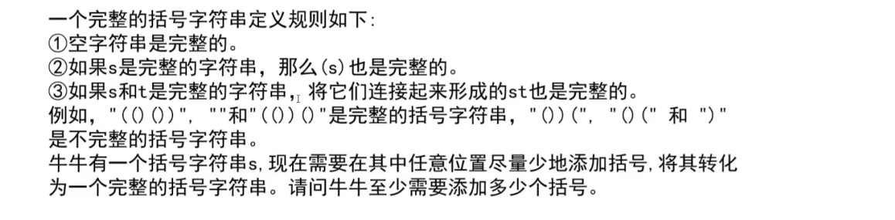
> 用一个变量cur记录
> 每次遇到'('则+1,遇到')'则-1
> 如果cur<0，则说明当前为多余的']'，我们用一个变量rev来记录它
> 然后让cur继续为0,往下走
> 最后让cur + rev就是所需的括号

[至少需要的括号](middle/6.最少需要的括号.go)
###### 近似题目推荐
牛客：https://www.nowcoder.com/practice/fe8d6a1b88af4ba6b4dbb10972059040?tpId=143&tqId=33932&rp=1&ru=/exam/oj&qru=/exam/oj&sourceUrl=%2Fexam%2Foj%3FtopicId%3D143&difficulty=undefined&judgeStatus=undefined&tags=&title=


> 用hash表即可

[去重数字对](middle/7.去重数字对.go)

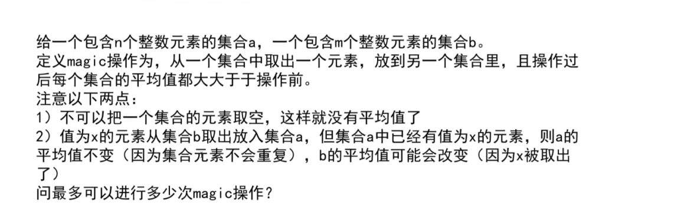
> 根据magic操作的特点，我们可以得到
> 1. 如果两个数组的平均值一样，则无法进行magic操作
> 2. 无法从平均值较小的数组将数放到平均值较大的数组中
> 3. 较大的给较小的值，只能给小于大数组平均数并且大于小数组平均数的，才能满足二者都提升
> 4. 为了尽可能的多进行magic操作，我们需要从满足条件的数中从小到大给，才能保证每次提升的幅度较小

[最多的magic操作](middle/8.最多的magic操作.go)

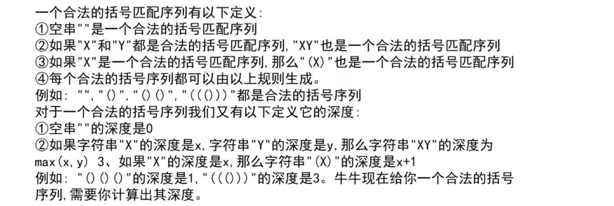
>左括号的连续个数即是一组括号字符串的深度
>用一个变量cur记录连续的'(',如果max=cur，则接下来的左括号+1的时候，最大深度max也会+1
>如果cur<max，则说明当前的深度还没达到前面有记录的最大深度，不用理会

[括号字符串深度](middle/9.括号字符串的深度.go)

牛客：https://www.nowcoder.com/practice/a2d5b1875bb0408384278f40d1f236c9?tpId=182&tqId=34550&ru=/exam/oj

###### 拓展
```
求一个括号字符串的最大有效子串
例如："(())(()()()(())("
为()()()(())
```
>记录以每一个位置为末位的有效子串的长度
>每一个都可以根据前一位的有效长度来判断
>如果当前为 (，则不可能生成有效子串直接为0
>如果当前为),判断前一位是否为0且为(，如果是则长度为2,然后再加上前两位的有效长度，形成一个更长的有效子串
>如果当前为),且前一位不为0,则说明前面已有子串，判断前面连续子串之前的那一位是否为(
>如果是，则当前最大长度为前一位的最大子串+2+前面子串再前两位的子串长度
>如果不是,则当前为0

[最大的有效子串长度](middle/11.最大有效子串的长度.go)

leetcode:https://leetcode.cn/problems/longest-valid-parentheses/submissions/


[栈排序](middle/10.栈排序.go)

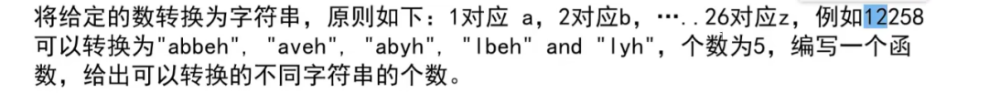
> 每个字符可能有两种状态，自己为一个值，或者和后面的联合为一个值

[数字转字符串](middle/12.给定数字转字符串.go)

leetcode:https://leetcode.cn/problems/ba-shu-zi-fan-yi-cheng-zi-fu-chuan-lcof/submissions/


> 二叉树套路，当前树的最大权值和等于左树的最大权值和与右数权值和中更大的一个+当前权值

[最大权值和](middle/13.二叉树的最大权值和.go)


> 从矩阵右上角开始遍历

[数字是否存在于排序矩阵中](middle/14.判断数字是否在矩阵中.go)

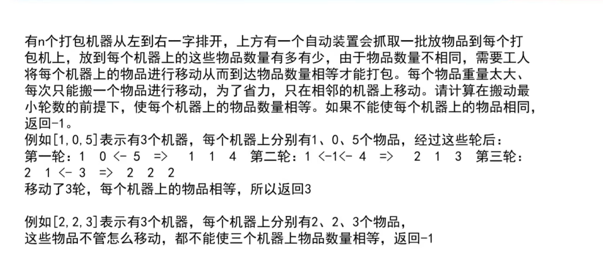
> 这种问题记住，判断每个位置它左右两边物品的个数
> 如果多，则为正，如果少则为负数
> 1. 如果两边都为负数，则两边都缺需要中间抛出，因为只能抛出一件，所以总次数为两个数的绝对值相加
> 2. 如果一个为正一个为负，则当前位置既要抛出，也要收入，这两件事情可以同时进行，所以操作的次数为两者中较大的绝对值
> 3. 如果两个都为正，则两边同时向中间抛，需要的次数也是两者中较大的
> 4. 最终，所有位置里面操作次数最多的即为计算的最少轮数

[洗衣机问题](middle/15.洗衣机问题.go)

leetcode:https://leetcode.cn/problems/super-washing-machines/submissions/

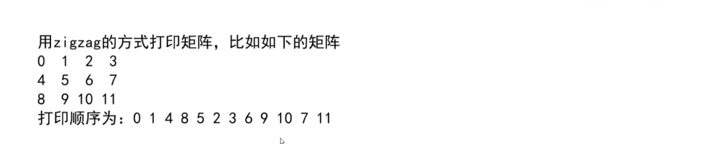
> 做此类打印矩阵或操作矩阵位置的题，需要的是宏观视角，不能盯着每个位置如何变化
> 这道题需要两个变量n,m,它们一开始都位于矩阵左上角点
> 1. n向左移动，m向下移动,打印它们连线上的元素
> 2. n到最左边，n向下移动，m到最右边，m向左移动，打印n和m连线上的元素

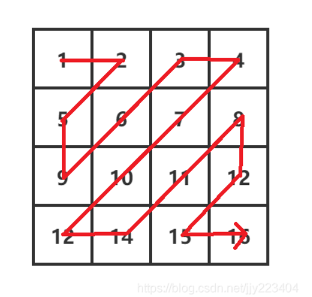
> 从上面的图可以看到我们总共走的次数
> m和n两个点，如果是偶数次则从m到n,如果是奇数，则从n到m遍历打印

[之字遍历矩阵](middle/16.zigzag.go)
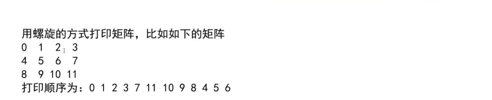
> 分层遍历，将一个矩阵分成很多层
> 从外层开始一层一层的打印
> 每次只需要知道左上角点和右下角的点即可

[顺时针打印矩阵](middle/17.顺时针打印矩阵.go)
> 这题的临界条件还是蛮烦的

leetcode:https://leetcode.cn/problems/shun-shi-zhen-da-yin-ju-zhen-lcof/submissions/

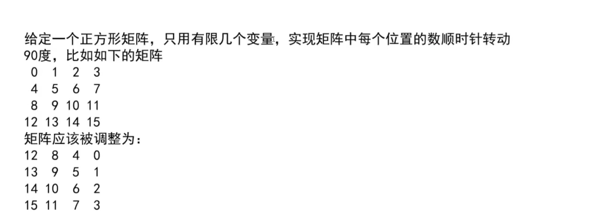
> 和上题一样，分层处理
> 不过这个在每一层中还要分组交换

[旋转矩阵](middle/18.旋转矩阵.go)

leetcode:https://leetcode.cn/problems/rotate-matrix-lcci/submissions/


> 这一题用堆来解答，通过维护一个大根堆或小根堆
> 如果是大根堆，则将所有字符串及其次数所组成的键值对入堆，然后再取出前k个
> 如果是小根堆，则只用k的长度，以后的元素如果小于堆头，则无法进堆

[出现次数前k的字符串](middle/19.出现次数为前k个的字符串.go)
> 力扣这个字典序让我写堆写的很难受

leetcode:https://leetcode.cn/problems/top-k-frequent-words/submissions/